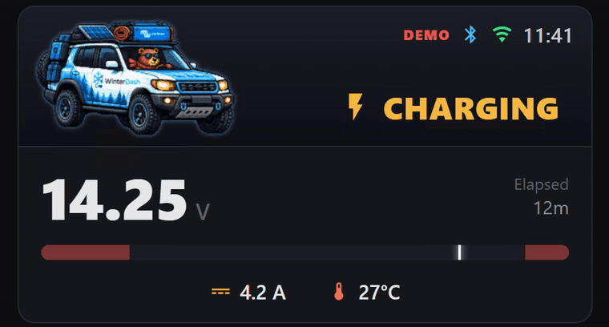

<h1 align="center">WinterDash</h1>
<p align="center"><em>Know what your Victron Blue Smart charger is doing — at a glance, all winter.</em></p>
<p align="center">
  <a href="https://witekin.github.io/winterdash/">🌐&nbsp;Website</a> ·
  <a href="https://witekin.github.io/winterdash/flash/">⚡&nbsp;Flash a board</a> ·
  <a href="https://github.com/witekin/winterdash/wiki">📖&nbsp;Wiki</a> ·
  <a href="LICENSE">GPL-3.0</a>
</p>

<p align="center">
  
</p>

A tiny open-source gadget that reads your **Victron Blue Smart** battery charger over Bluetooth ("Instant Readout")
and shows its status — voltage, current, charge stage — on a **little screen on the device**, on a **web page you
open from your phone**, and optionally in **Home Assistant**. Aimed at non-technical friends keeping an eye on a
car / motorcycle / boat battery over the winter — plus makers who want to build or flash one. It runs on a cheap
ESP32 board (from ~€7); a realistic **demo mode** plays a full charge cycle with no charger connected.

> Independent open-source project — not affiliated with, endorsed by, or sponsored by Victron Energy.
> "Victron" and "Blue Smart" are trademarks of Victron Energy B.V., used only to describe compatibility.

## Get started

- **I have a WinterDash** — you set one up, or were handed one →
  [**Set it up**](https://github.com/witekin/winterdash/wiki/Install-and-update#first-time-setup) ·
  [Reading your WinterDash](https://github.com/witekin/winterdash/wiki/Reading-your-WinterDash) ·
  [The web dashboard](https://github.com/witekin/winterdash/wiki/The-web-dashboard)
- **I want to build or flash one** →
  [**Flash a ready-made build in your browser**](https://witekin.github.io/winterdash/flash/) ·
  [Supported chargers & boards](https://github.com/witekin/winterdash/wiki/Supported-chargers-and-boards) ·
  [Build from source](https://github.com/witekin/winterdash/wiki/Build-from-source)

The **[project wiki](https://github.com/witekin/winterdash/wiki)** has the full install, setup, pairing, and
Home Assistant guides.

## How it works

ESPHome firmware for a **LilyGO TTGO T-Display** (ESP32, ST7789V 135×240 IPS) that shows the charger's BLE "Instant
Readout" broadcast on the built-in display via LVGL (6 screens + 2-button nav), plus a device-hosted web dashboard.
The same firmware also runs headless on a screenless ESP32 (status LED + web dashboard). Home Assistant is an
optional link over the native API. The charger broadcast is read-only and AES-encrypted — WinterDash never writes
to the charger.

## Status

Working on real hardware; the Victron decode is live-verified on a Blue Smart IP65s 12/5 (fw 3.65) through a full
charge cycle (Bulk → Absorption → Float). Shipping boards: TTGO T-Display (16 MB and 4 MB) and a screenless
ESP32-WROOM-32; the CYD touch board is in progress. See the
**[wiki](https://github.com/witekin/winterdash/wiki)** for install, flashing, and usage.

## Hardware summary

- **Board:** LilyGO TTGO T-Display (16 MB or 4 MB), or a screenless ESP32-WROOM-32
- **MCU:** ESP32 (WiFi + BLE, no PSRAM)
- **Display:** IPS ST7789V, 135×240, SPI (ESPHome `mipi_spi` model `T-DISPLAY`) — TTGO only
- **Input:** BLE broadcast from a Victron charger (read-only, AES-encrypted)
- **Output:** local LVGL display + optional Home Assistant (native API)

## Charger pairing

Done at runtime in the web Settings (no rebuild): scan → pick the Victron MAC, paste the bindkey
(VictronConnect → Product info → "Instant readout via Bluetooth" → Show; needs charger fw ≥ 3.61).
Keys live in NVS, never in the firmware image. Tested on a Blue Smart IP65s 12/5 (fw 3.65); other
single-output Blue Smart 12V/24V are expected to work (same BLE record).

## Repository layout

```
.
├── site/             # the landing page + browser installer (served via GitHub Pages)
├── web/              # dashboard.html · onboarding.html (Wi-Fi setup) · image-tool.html (/convert)
├── LICENSE           # GPL-3.0 (the firmware links GPL-3.0 components — see CREDITS.md)
├── CREDITS.md        # third-party notices + trademark / non-affiliation
└── esphome/
    ├── esp32-tdisplay-16mb.yaml  # TTGO T-Display, 16 MB (screen + 2-button nav) — the main board
    ├── esp32-tdisplay-4mb.yaml   # TTGO T-Display, 4 MB (same, one saved banner)
    ├── esp32-wroom32.yaml        # screenless ESP32 build (status LED + web dashboard)
    ├── packages/                 # board / display / input / core / producer packages
    ├── components/captive_portal/ # vendored ESPHome captive — branded Wi-Fi onboarding page
    ├── tools/                    # generators for the flash-baked HTML + setup QR
    ├── *.h                       # web pages baked to flash + BLE scan + charge log
    └── images/*.webp             # baked banner cut-outs (Battery = default + fallback)
```

## License

**GPL-3.0** — the distributed firmware links GPL-3.0 components (ESPHome, esphome-victron_ble), so the
combined binary is GPL-3.0 and the full source is this repository. Third-party notices, dependencies,
and the trademark / non-affiliation statement are in [CREDITS.md](CREDITS.md).
